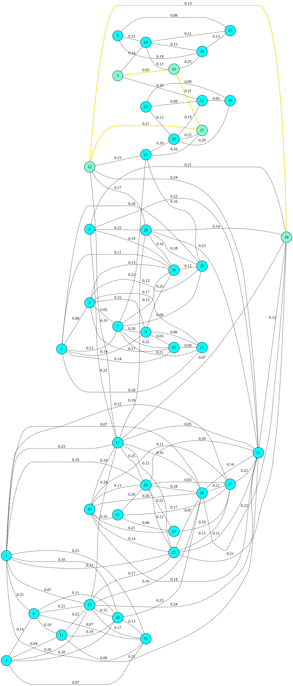
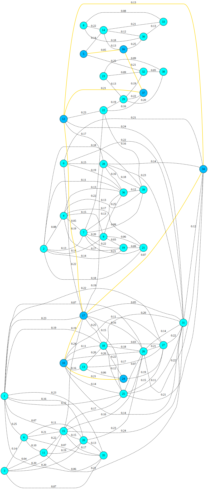
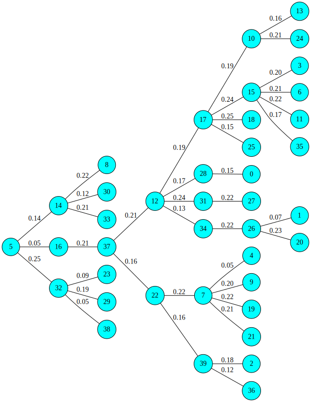

## Graphs

This directory contains collection of graph search algorithms

### A-star search algorithm

A* is a graph algorithm that is used in pathfinding and graph traversal. 

Pythonic definition of the graph can be found `graphs/src/helper/map40.py`

Visualization of the search is done for a graph with 40 nodes using `Pydot` and `Graphviz`. `draw_map` method generates the SVG documents corresponding to

* A search which starts at node `5` and ends in node `34`
* A search which starts at node `8` and ends in node `24`

#### Search starting at node `5` and ending at node `34`

#### Search starting at node `8` and ending at node `24`

### Single source shorest path problem

Here we are using the same map (network of road intersections and the roads connecting them) to find the shorest path starting from `node = 5`. Execution of Dijkstra's algorithm results in producing a spanning tree.

#### Search starting at node `5` and ending at node `34`

SVG documents have additional information which can be visualized when the document is downloaded and opened in a browser (e.g. mouse over the nodes shows their X,Y coordinate values). These coordinate values are used to compute the distance between two nodes. The heuristic cost for A* uses Eucleadian distance between current node and destination node.

### Literate programming

In `literate programming` folder there is an example of Python notebook which uses `Latex` scripts for mathematical formulas. The markdown cells explain proof that iteration converges and basis behind the iterative formula for computing square root using Babylonian method.

### References

* [DOT language](https://www.graphviz.org/doc/info/lang.html)
* [Drawing graphs with dots](https://www.graphviz.org/pdf/dotguide.pdf)
* [Pydot](https://pypi.org/project/pydot-ng/)

## Authors

* **Abhijit Bhattacharya** 
